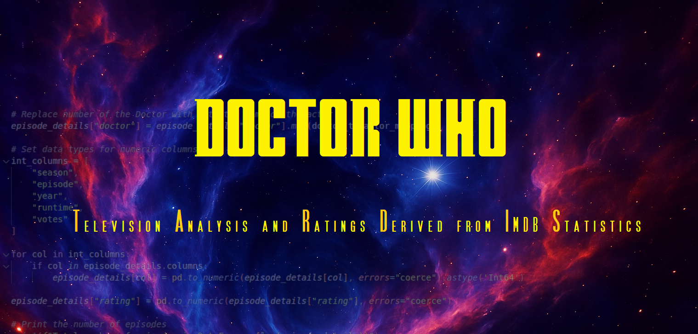

<p align="center">
  
</p>

# Doctor Who IMDb Analysis

Ever wondered which *Doctor Who* seasons were most loved by fans?  
This data science project dives deep into IMDb data to uncover the highs, lows, and hidden gems of the longest-running sci-fi series in TV history. 
We use a data-driven analysis to answer the question: **Who is the best Doctor?**

**Highlights:**
- Rating trends across Doctors and showrunners  
- Statistical analysis of season quality  
- Visual storytelling with clear, intuitive plots  

If you're not into the technical details, check out the non-technical [blog post](https://mark-bugden.github.io./portfolio/doctorwho.html).
Curious to explore the analysis? Simply open the `doctor-who-imdb-analysis.ipynb` notebook to read through it.
Comfortable with Python and want to run it yourself? Just follow the setup instructions in the "Getting Started" section below.

## Project Structure

```
.
├── data/                               # Contains raw and processed IMDb data (not tracked in version control)
├── doctor-who-imdb-analysis.ipynb      # The main analysis notebook
├── utils.py                            # Helper functions for loading and processing data
├── README.md
└── requirements.txt                    # Python dependencies
```


## Getting Started

1. **Clone the repo**

```bash
git clone https://github.com/Mark-Bugden/doctor-who-imdb-analysis.git
cd doctor-who-imdb-analysis
```

2. **Create a virtual environment**

```bash
python3 -m venv .venv
source .venv/bin/activate
```

3. **Install dependencies**

```bash
pip install -r requirements.txt
```

4. **Open the notebook**

```bash
jupyter notebook doctor-who-imdb-analysis.ipynb
```

> The notebook will guide you through the full analysis step-by-step.


